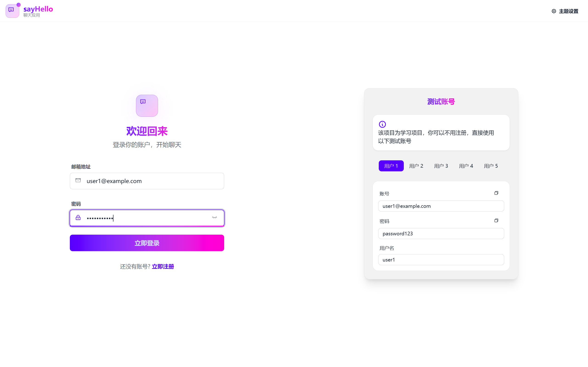
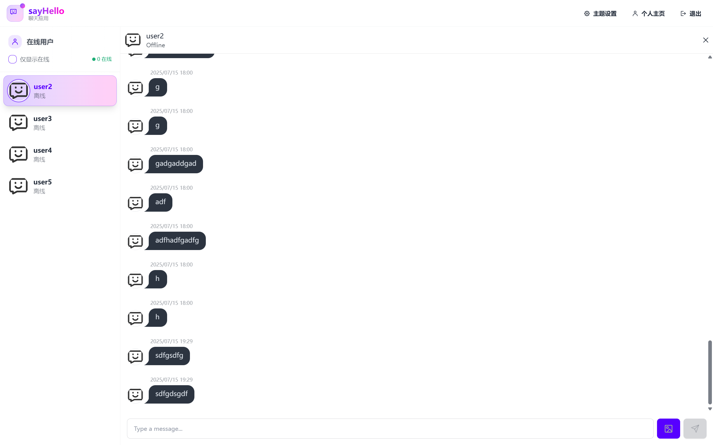

# SayHello - 实时聊天应用

<p align="center">
  
</p>

一个基于 react 构建的现代化实时聊天应用，支持文本消息、图片分享、多主题切换和实时在线状态显示。

## 📸 截图展示

<p align="center">
  
  
</p>

## ✨ 主要特性

### 🔐 用户认证

- 用户注册和登录
- JWT 双令牌认证机制（Access Token + Refresh Token）
- 自动令牌刷新
- 安全的密码加密存储

### 💬 实时聊天

- 基于 Socket.io 的实时消息传输
- 支持文本和图片消息
- 实时在线状态显示
- 消息历史记录
- 分页加载历史消息
- 消息缓存优化

### 🎨 界面设计

- 响应式设计，支持移动端和桌面端
- 32 种 DaisyUI 主题可选
- 优雅的动画效果
- 虚拟滚动优化大量消息显示
- 现代化的 UI 组件

### 📱 用户体验

- 个人资料管理
- 头像上传（Cloudinary 云存储）
- 主题切换
- 消息清理功能
- 优化的性能表现

## 📄 许可证

本项目采用 MIT 许可证 - 查看 [LICENSE](LICENSE) 文件了解详情

---

**注意**：这是一个学习项目。

在 `backend` 目录下创建 `.env` 文件：

```env
PORT=5001
MONGODB_URI=
JWT_SECRET=
JWT_REFRESH_SECRET=
NODE_ENV=development

# Cloudinary 配置（用于图片上传）
CLOUDINARY_CLOUD_NAME=
CLOUDINARY_API_KEY=
CLOUDINARY_API_SECRET=
```
