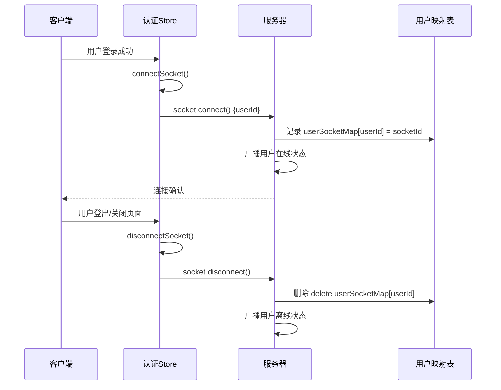
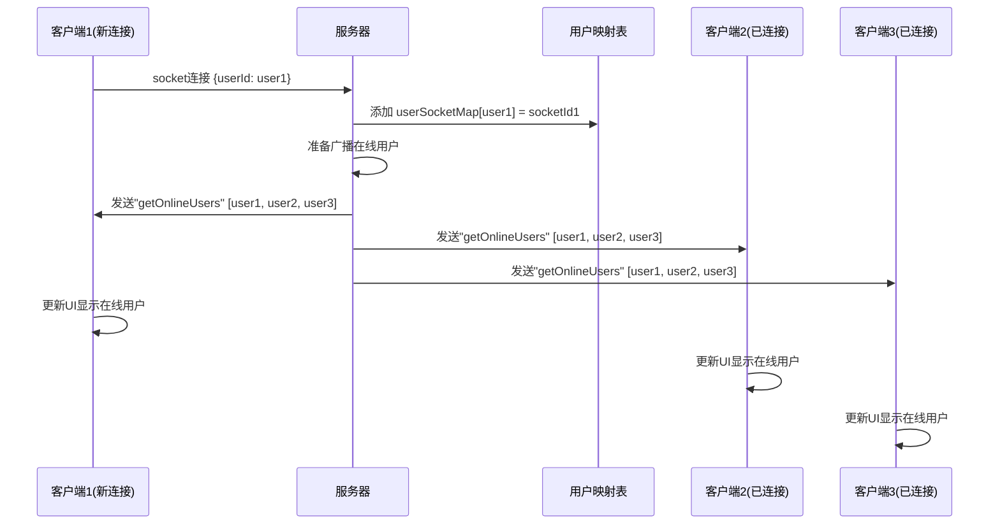
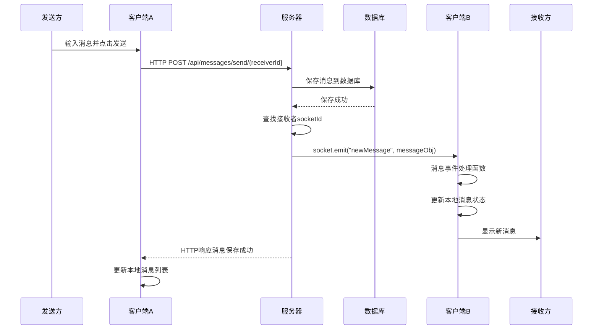
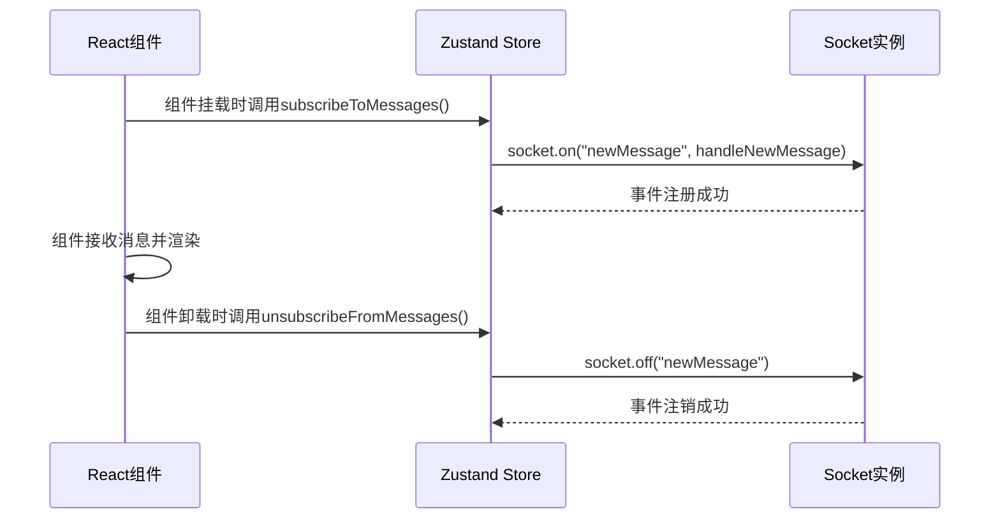
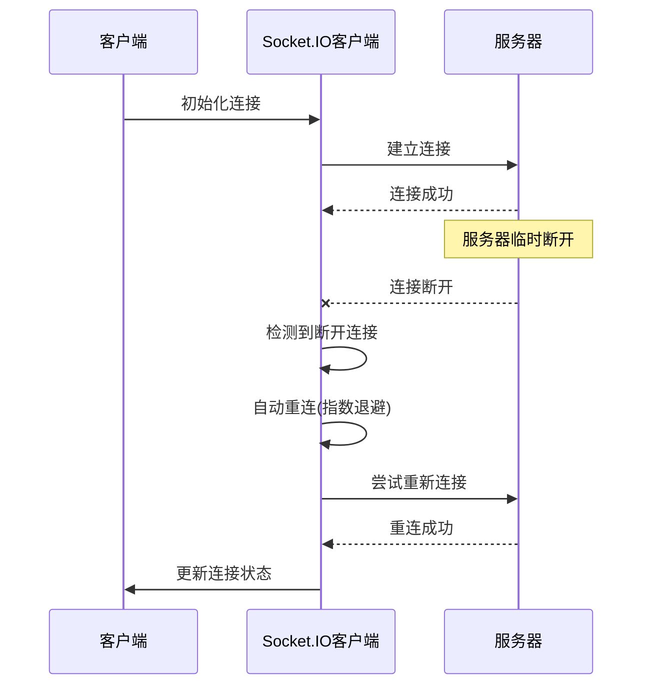
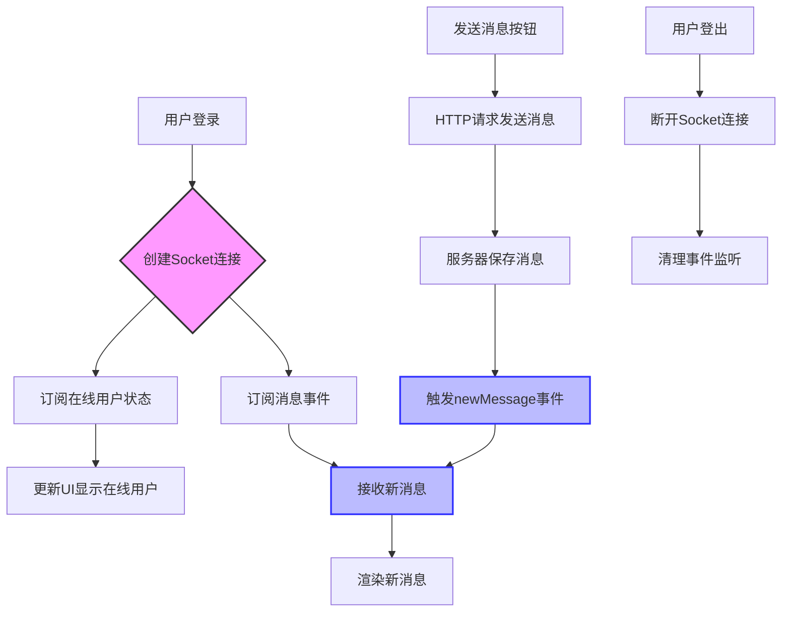

# sayHello 事件监听系统

## 目录

- [Socket 连接与断开](#socket连接与断开)
- [在线用户状态事件](#在线用户状态事件)
- [消息传输事件](#消息传输事件)
- [客户端事件订阅与取消订阅](#客户端事件订阅与取消订阅)
- [错误处理和重连机制](#错误处理和重连机制)

## Socket 连接与断开

当用户登录系统时，客户端会与服务器建立 Socket.IO 连接，当用户登出或关闭页面时，该连接会断开。



### 实现代码

**前端 (useAuthStore.js)**

```javascript
connectSocket: () => {
  const { authUser } = get();
  if (!authUser || get().socket?.connected) return;

  const socket = io(BASE_URL, {
    query: {
      userId: authUser._id,
    },
  });
  socket.connect();

  set({ socket: socket });

  socket.on("getOnlineUsers", (userIds) => {
    set({ onlineUsers: userIds });
  });
},

disconnectSocket: () => {
  if (get().socket?.connected) get().socket.disconnect();
}
```

**后端 (socket.js)**

```javascript
io.on("connection", (socket) => {
  console.log("A user connected", socket.id);

  const userId = socket.handshake.query.userId;
  if (userId) userSocketMap[userId] = socket.id;

  io.emit("getOnlineUsers", Object.keys(userSocketMap));

  socket.on("disconnect", () => {
    console.log("A user disconnected", socket.id);
    delete userSocketMap[userId];
    io.emit("getOnlineUsers", Object.keys(userSocketMap));
  });
});
```

## 在线用户状态事件

系统使用"getOnlineUsers"事件通知所有客户端当前在线的用户列表。



### 实现细节

前端订阅该事件，并在 Sidebar 组件中使用它来显示在线状态：

```javascript
socket.on("getOnlineUsers", (userIds) => {
  set({ onlineUsers: userIds });
});

// 在Sidebar组件中使用
{
  onlineUsers.includes(user._id) && (
    <span
      className="absolute bottom-0 right-0 size-3 bg-green-500 
  rounded-full ring-2 ring-zinc-900"
    />
  );
}
```

## 消息传输事件

当用户发送消息时，服务器会使用"newMessage"事件将消息实时发送给接收方。



### 实现代码

**后端发送消息：**

```javascript
// 在消息控制器中
const receiverSocketId = getReceiverSocketId(receiverId);
if (receiverSocketId) {
  io.to(receiverSocketId).emit("newMessage", newMessage);
}
```

**前端订阅消息：**

```javascript
subscribeToMessages: () => {
  const { selectedUser } = get();
  if (!selectedUser) return;

  const socket = useAuthStore.getState().socket;

  socket.on("newMessage", (newMessage) => {
    const isMessageSentFromSelectedUser =
      newMessage.senderId === selectedUser._id;
    if (!isMessageSentFromSelectedUser) return;

    set({
      messages: [...get().messages, newMessage],
    });
  });
},

unsubscribeFromMessages: () => {
  const socket = useAuthStore.getState().socket;
  socket.off("newMessage");
}
```

## 客户端事件订阅与取消订阅

为了防止内存泄漏和重复事件处理，客户端实现了订阅和取消订阅机制。



### 实现代码

在`ChatContainer`组件中的使用：

```javascript
useEffect(() => {
  getMessages(selectedUser._id);
  subscribeToMessages();

  return () => unsubscribeFromMessages();
}, [
  selectedUser._id,
  getMessages,
  subscribeToMessages,
  unsubscribeFromMessages,
]);
```

## 错误处理和重连机制

Socket.IO 内置了自动重连机制，但应用也实现了额外的错误处理逻辑。



### 实现说明

Socket.IO 客户端默认启用自动重连，可以通过配置选项调整：

```javascript
const socket = io(BASE_URL, {
  query: { userId: authUser._id },
  reconnection: true, // 启用重连
  reconnectionAttempts: 5, // 尝试重连次数
  reconnectionDelay: 1000, // 初始重连延迟
  reconnectionDelayMax: 5000, // 最大重连延迟
});
```

## 完整事件流

下图展示了从用户登录到聊天完成的完整事件流程：


