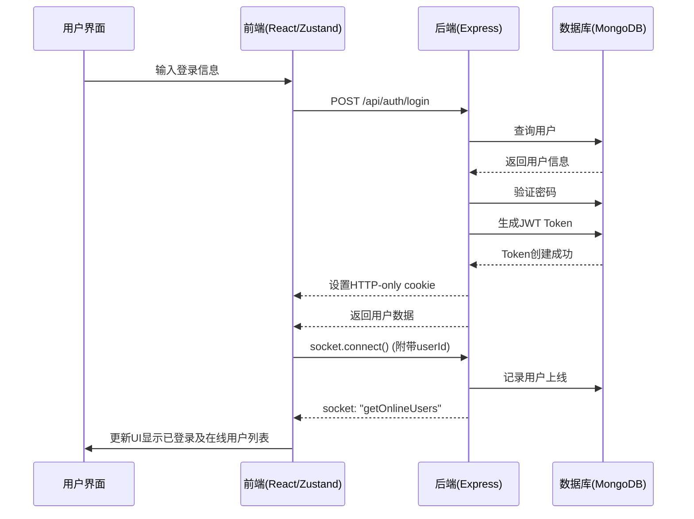
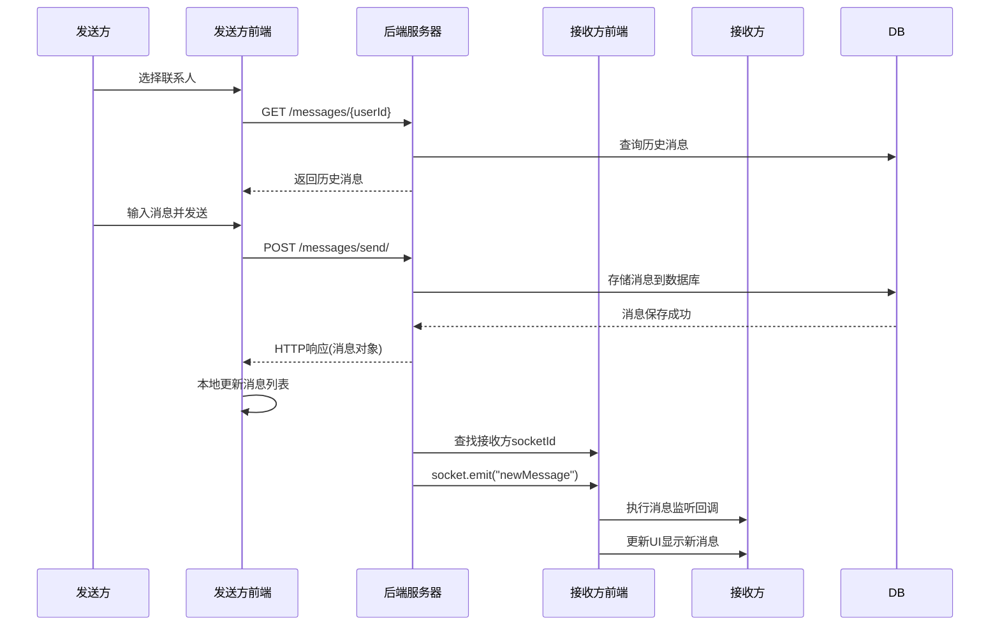
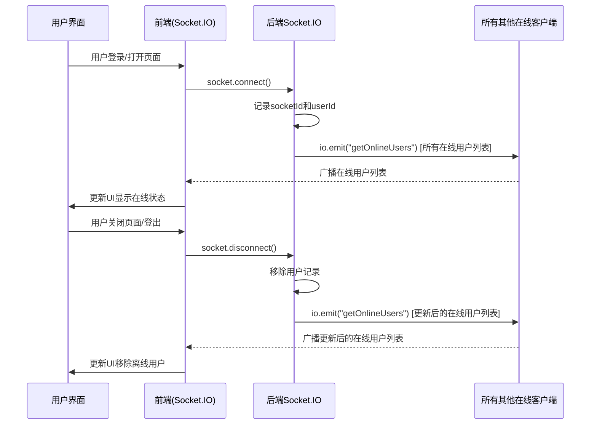
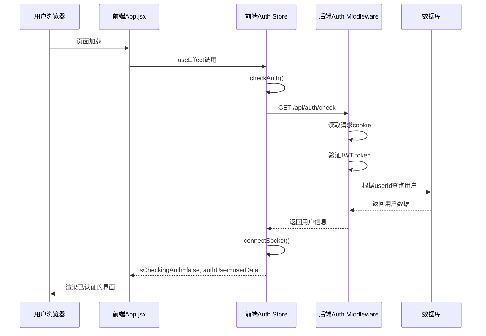
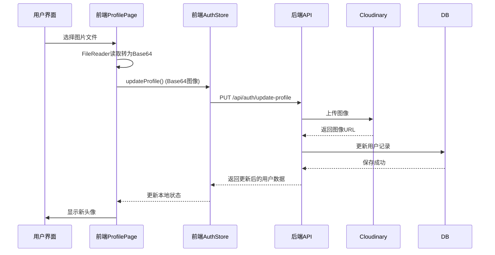
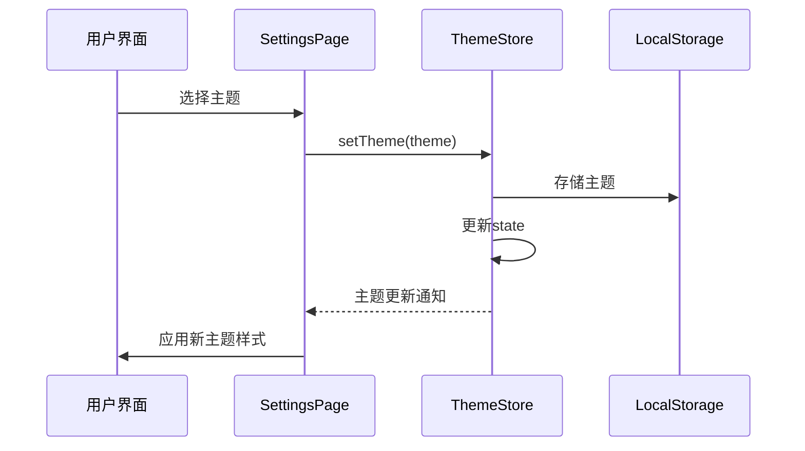
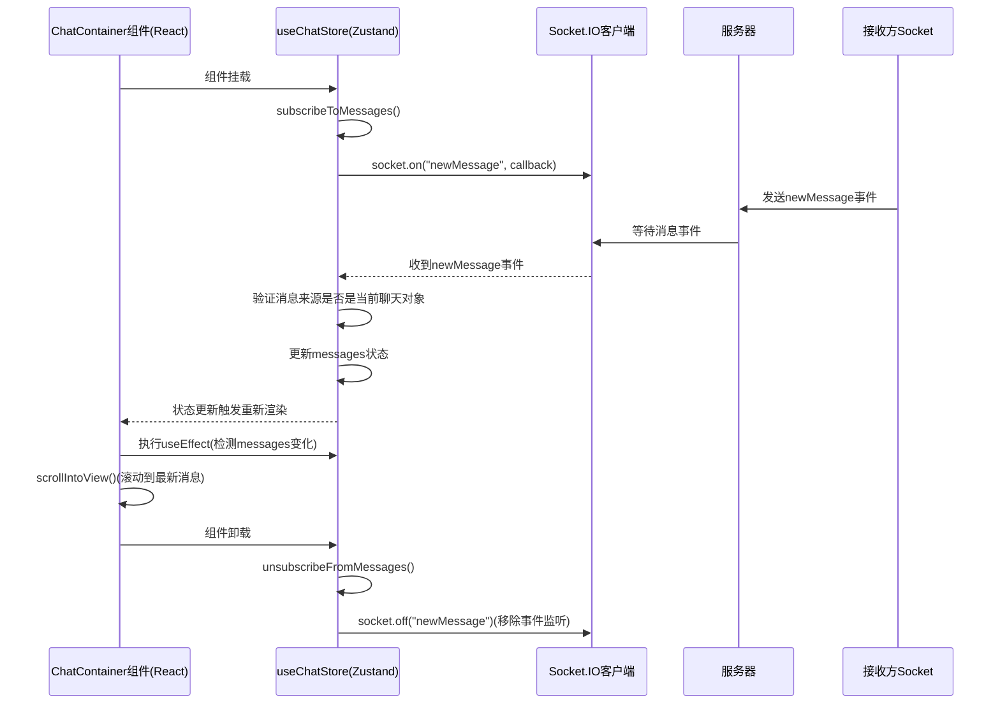
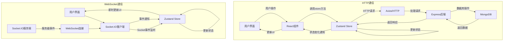
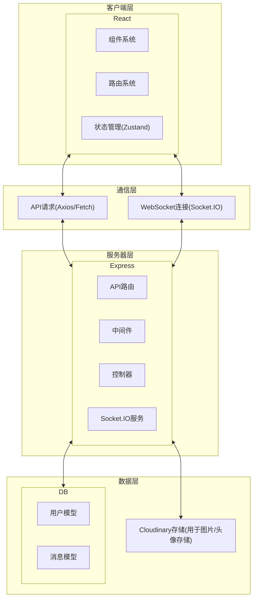

# sayHello 流程图文档

## 目录

- [登录认证流程](#登录认证流程)
- [消息发送与接收流程](#消息发送与接收流程)
- [用户上线/离线状态变更流程](#用户上线离线状态变更流程)
- [会话保持与恢复流程](#会话保持与恢复流程)
- [头像上传流程](#头像上传流程)
- [主题切换流程](#主题切换流程)
- [消息实时监听与更新流程](#消息实时监听与更新流程)
- [全栈数据流和通信概览](#全栈数据流和通信概览)
- [技术架构图](#技术架构图)

## 登录认证流程

## 消息发送与接收流程

## 用户上线离线状态变更流程

## 会话保持与恢复流程

## 头像上传流程

## 主题切换流程

## 消息实时监听与更新流程

## 全栈数据流和通信概览

## 技术架构图

